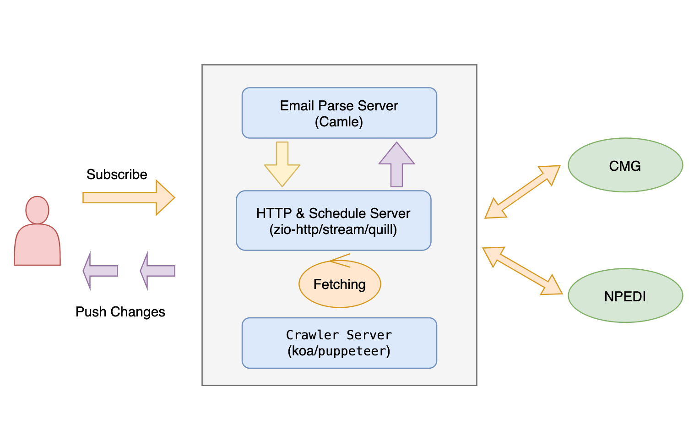

## Overview
This is a real service(like a SAAS), design for someone who want to know latest information about a voayage.


## About This Project
This project is the `http&schedule` part using prue `zio` implement.
- [zio-http](https://github.com/zio/zio-http), deal with http part
- [zio-stream](https://zio.dev/reference/stream/), deal with schedule part
- [zio-quill](https://github.com/zio/zio-quill), database part

## About Email & Crawler
> Due to Privacy Information, not publish

- [Camel](https://camel.apache.org/), receive & send Email
- [Puppeteer](https://pptr.dev/), deal with some site that need loging state
- [Koa](https://koajs.com/), combine with `Puppeteer` , act as API proxy

## Custom Response Scheme
### 1, CMG
```
{
    "InnerList": [
        {
            "TerminalCode": "CCT",          // 港区
            "ETADate": "2022-09-20 11:00",  // ETA
            "ServiceId": "IFX",             // 
            "InServiceId": "IFX",           // 进口航线	
            "OutServiceId": "IFX",          // 出口航线	
            "ShipId": "XTJN",               // 船代码	
            "TheFullName": "XIN TIAN JIN",  // 船名	
            "LINEID": "COS",                // 船公司
            "invoynbr": "076WI",            // 进口航次	
            "outvoynbr": "076W",            // 出口航次
            "POB": "2022-09-21 03:30",      // POB
            "ETB": "2022-09-21",            // ETB
            "ETD": "2022-09-21 23:30",      // ETD
            "ATA": "2022-09-21 04:30",      // ATA
            "ATD": "2022-09-21 23:30",      // ATD
            "Notes": "已开始收箱",            // 备注
            "IMO": "UN9234343",             // IMO
            "INBUSINESSVOY": "076WI",       // 进口商业航次码
            "OUTBUSINESSVOY": "076W",       // 出口商业航次码
            "Inagent": "COS",               // 进口代理	
            "Outagent": "COS"               // 出口代理	
        }
    ],
    "TotalPages": 1,
    "TotalCount": 1,
    "PageIndex": 1,
    "PageSize": 999
}
```
### 2, NPEDI
```
{
  "code": 200,
  "msg": "操作成功",
  "data": {
    "pageNum": 1,
    "pageSize": 1,
    "total": 1,
    "totalPages": 0,
    "list": [
      {
        "mmsi": "352361000",
        "vesselEnName": "MSC BETTINA",
        "vesselCnName": "地中海贝蒂娜",
        "vesselCode": "MSCET",
        "vesselUnCode": "UN9399038",
        "terminal": "BLCT3",
        "voyage": "FK243A",
        "vesselDirect": "E",
        "tradeFlag": "W",
        "vesselReference": "MSCET1030",
        "imo": "1",
        "vesselSysid": "0",
        "vesselOwner": "MSC",
        "vesselAgent": "PEN",
        "serviceCode": null,
        "lineOperatorCode": "MSC",
        "ctnStartTime": "2022-10-26 00:00:01",
        "ctnEndTime": "2022-10-31 00:00:01",
        "hazardStartTime": null,
        "hazardEndTime": null,
        "spHazardStartTime": null,
        "spHazardEndTime": null,
        "etaMonthly": "2022-10-30 14:00:00",
        "etdMonthly": "2022-10-31 00:00:01",
        "etaRecently": null,
        "etdRecently": null,
        "etaDaily": "2022-10-31 16:30:00",
        "etdDaily": "2022-11-01 14:00:00",
        "eta": "2022-10-31 16:30:00",
        "etd": "2022-11-01 14:00:00",
        "etanchor": "2022-10-31 00:00:01",
        "atanchor": "2022-10-31 00:00:01",
        "ata": null,
        "atd": null,
        "ats": null,
        "ate": null,
        "ets": null,
        "ete": null,
        "voycloseTime": null,
        "customCloseTime": "2022-10-31 04:30:00",
        "portCloseTime": "2022-10-31 04:30:00",
        "berthReference": "10",
        "ports": "AEJEA: INNSA: CNFOC: ZADUR: IQUQR: IRBND: BRSSZ: BRPNG: ARBUE: UYMVD: BRRIG: SGSIN: BRNVT: HKHKG: OMSLL: ESVL1: ESBCN: ESVLC: ITGIT: ITSPE: MTMAR: FRFOS: CNCWN: ITGOA: SADM1: LKCM1: IQUQ1: AEJE1: SAJU1: INMU1: QAHM1: QAHMD: AEAUH: CNSHA: AEKH1: AEAU1: SAKAC: KWSAA: CNSHK: INNS2: INNS1: LKBUT: INMNB: MYTPP: LKCMB: SADMM: SAJUB: INMUN",
        "lastPortCode": "CNSHA",
        "nextPortCode": "CNSHK",
        "lastPortName": "上海",
        "nextPortName": "蛇口",
        "voyagePublishTime": null,
        "voyagePublished": "Y",
        "publishTime": "2022-10-25 09:22:57",
        "published": "Y",
        "modifyCode": null,
        "modifyRemark": null,
        "vesselOwnerCtnTimes": null,
        "status": "Y",
        "vesselAgentName": "外代",
        "etaBegin": null,
        "etaEnd": null,
        "ataBegin": null,
        "ataEnd": null
      }
    ]
  }
}
```
### 3, HB56
```
{
    "code": 200,
    "msg": "success",
    "tabs": [
        {
            "total": 1,
            "rows": [
                {
                    "TERM": "冠东(洋3)",
                    "TER_SID": "100308",
                    "VSL_CNNAME": "伊夫林马士基",
                    "VSL_MMSI": "220496000",
                    "VSL_ENNAME": "EVELYN MAERSK",
                    "IVOYAGE": "244WI",
                    "EVOYAGE": "244W",
                    "AGENTNM": "上港联代",
                    "SCDSTATUS": "确报",
                    "SCD_ETA": "2022-11-01 09:00",
                    "SCD_ATA": "2022-11-01 09:00",
                    "SCD_CULOC": "洋山锚地",
                    "VSL_VTPCODE": "全集装箱船",
                    "SCD_FPOT": "宁波",
                    "SCD_ID": 1390708,
                    "SEARCH_CONDITION": "EVELYNMAERSK244WI/244W伊夫林马士基244WI/244W",
                    "ENNAME": "EVELYNMAERSK"
                }
            ]
        },
        {
            "total": 1,
            "rows": [
                {
                    "TERM": "冠东(洋3)",
                    "TER_SID": 100308,
                    "VBTSTATUS": "未靠泊",
                    "VSL_CHN_NAME": "伊夫林马士基",
                    "VSL_MMSI": "220496000",
                    "SCD_ENG_NAME": "EVELYN MAERSK",
                    "IVOYAGE": "244WI",
                    "EVOYAGE": "244W",
                    "SBT_PSTTM": "2022-11-01 10:30",
                    "SBT_ASTTM": null,
                    "SBT_PEDTM": "2022-11-02 00:30",
                    "SBT_AEDTM": null,
                    "AGENTCN": "联合船代",
                    "VOY_SKEY": 100308607318,
                    "SOURCE_VERSION": "5",
                    "SCD_SKEY": 100308499400,
                    "SCD_PKID": "5100308499400",
                    "TER_SID1": 100308,
                    "SEARCH_CONDITION": "EVELYNMAERSK244WI/244W伊夫林马士基244WI/244W",
                    "ENNAME": "EVELYNMAERSK"
                }
            ]
        },
        {
            "total": 1,
            "rows": [
                {
                    "TERM": "冠东(洋3)",
                    "TER_SID": 100308,
                    "SCD_CHN_NAME": "伊夫林马士基",
                    "VSL_MMSI": "220496000",
                    "SCD_ENG_NAME": "EVELYN MAERSK",
                    "SCD_ENG_NAME1": "EVELYN MAERSK",
                    "EVOYAGE": "244W",
                    "SCD_RCVSTDT": "<div style='color:red;'>&#xF9BD;&#xEA56;&#xF9BD;&#xF9BD;-&#xF02A;&#xEA56;-&#xE007;&#xEA56; &#xF02A;&#xF9BD;:&#xEA56;&#xEA56;</div>",
                    "ICD_RCVDT": null,
                    "SCD_RCVEDDT": "&#xF9BD;&#xEA56;&#xF9BD;&#xF9BD;-&#xF02A;&#xF02A;-&#xEA56;&#xF9BD; &#xEA56;&#xEA56;:&#xE007;&#xEA56;",
                    "AGENTCN": "联合船代",
                    "VOY_SKEY": 100308607318,
                    "SOURCE_VERSION": "5",
                    "SEARCH_CONDITION": "EVELYNMAERSK244WI/244W伊夫林马士基244WI/244W",
                    "ENNAME": "EVELYNMAERSK"
                }
            ]
        }
    ],
    "cost": 0.789
}
```